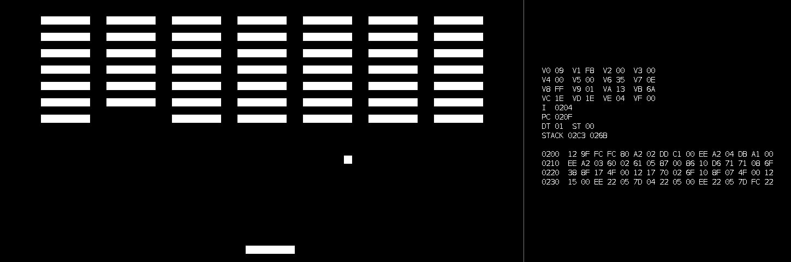
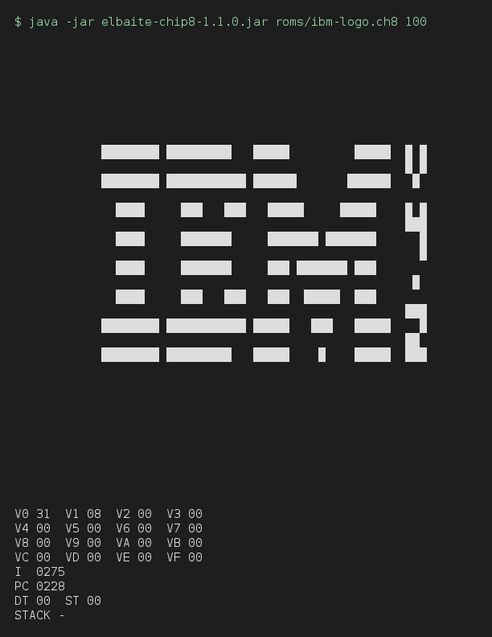
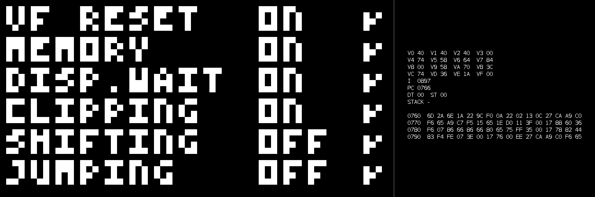

<!--suppress HtmlDeprecatedAttribute, CheckImageSize: GitHub strips CSS from a README, so align is the only
    way to centre, and the screenshots are shown smaller than they are on purpose. -->

# Elbaite

<p align="center">
  
</p>

Emulators written in Java, each named for a variety of elbaite, a kind of tourmaline. The first, **Achroite**, is a
CHIP-8 emulator, and it's done. Achroite is elbaite's colourless variety, which suits CHIP-8's one-bit screen.
**Verdelite** (Game Boy) and **Paraíba** (Game Boy Color) are planned.

<p align="center">
  
</p>

Achroite runs on Windows and Linux with nothing else to install, and anywhere else Java 25 runs: see
[Download](#download).

## Why

I was replaying a lot of old Game Boy games recently, mostly the Pokémon ones, and I was itching for a new project
when it hit me: why not build an emulator myself? I'd used plenty of emulators over the years, but I'd never actually
stopped to ask how they work. So I started reading, and I realized pretty quickly that a Game Boy emulator was out of
reach for my current skills.

More reading led me to CHIP-8, a small virtual machine from 1977 that ran simple games on hobby computers. It has 35
instructions, sixteen one-byte registers, and a 64 by 32 screen of one bit per pixel, which makes it tiny next to the
Game Boy. That made it the perfect warm-up: a whole machine small enough to finish, and a way to build the skills the
Game Boy is going to need.

## Achroite

- **Every CHIP-8 instruction** of the original COSMAC VIP interpreter, except `0NNN` (see Limits).
- **Runs in real time** in a Swing window: sixty frames a second, up to ten instructions a frame, with the keyboard
  mapped onto the VIP's hex keypad. ROMs open from its File menu.
- **Sound:** a 441 Hz tone for as long as the sound timer runs.
- **Quirks:** where CHIP-8 interpreters disagree, a preset picks whose behaviour to follow: the original VIP (the
  default), SUPER-CHIP, or Octo. In the window, a menu switches presets, or each of the six quirks on its own.
- **A debugger:** pause, step one instruction at a time, and a live view of the registers, timers, stack, and the memory
  at the program counter.
- **A terminal mode** that runs a fixed number of steps and prints the screen and registers, for checking a ROM's
  output exactly.
- **Packages for Windows and Linux**, each carrying its own Java runtime, and a jar for anywhere else.
- **176 unit tests.**

## Download

The [latest release](https://github.com/noahparknguyen/elbaite/releases/latest) has these files:

| File                                   | What it is                                                |
|----------------------------------------|-----------------------------------------------------------|
| `elbaite-chip8-1.1.0-windows-x64.exe`  | The Windows installer                                     |
| `elbaite-chip8-1.1.0-windows-x64.zip`  | Windows, portable: runs from any folder                   |
| `elbaite-chip8-1.1.0-linux-x64.deb`    | The package for Ubuntu 22.04 or later, Debian 12 or later |
| `elbaite-chip8-1.1.0-linux-x64.tar.gz` | Linux, portable: runs from any folder                     |
| `elbaite-chip8-1.1.0.jar`              | The jar, for any system with Java 25, macOS included      |
| `SHA256SUMS`                           | Every file's checksum, for checking a download            |

The four packages each carry their own Java runtime, so there's nothing else to install.

### Installing and removing

**The Windows installer.** Run it. Achroite isn't signed with a code-signing certificate, so Windows may first say
"Windows protected your PC": choose **More info**, then **Run anyway**. It installs for you alone, without administrator
rights, into `%LOCALAPPDATA%\Achroite`, and offers a Start menu entry and a desktop shortcut. A newer version's
installer replaces the older version.

To remove it, open **Settings → Apps → Installed apps** (**Apps & features** on Windows 10) and uninstall Achroite.
That removes everything it installed.

**The Windows zip.** Unzip it anywhere and run `Achroite\Achroite.exe`. Windows may warn the same way. To remove it,
delete the folder: Achroite keeps nothing anywhere else.

**The `.deb`.** From the folder with the download:

```
sudo apt install ./elbaite-chip8-1.1.0-linux-x64.deb
```

Achroite then appears among the desktop's games, and `/opt/achroite/bin/Achroite` runs it from a terminal. To remove
it:

```
sudo apt purge achroite
```

**The `.tar.gz`.** Unpack it anywhere and run `Achroite/bin/Achroite`. To remove it, delete the folder.

On Linux, Java keeps a small font cache in `~/.java/fonts`, for Achroite as for every Java program, and removing a
package leaves it, since packages don't touch home folders. It's only a cache: `rm -r ~/.java/fonts` deletes it.

**The jar.** With Java 25 installed, `java -jar elbaite-chip8-1.1.0.jar` runs it. To remove it, delete it.

### Checking a download

`SHA256SUMS` lists the SHA-256 checksum of every file in the release. On Linux, from the folder with the downloads:

```
sha256sum --check --ignore-missing SHA256SUMS
```

On Windows, in PowerShell, compare what this prints with the file's line in `SHA256SUMS`:

```
Get-FileHash elbaite-chip8-1.1.0-windows-x64.exe
```

Every file also has a signed attestation of the workflow that built it and the commit it was built from. The
[GitHub CLI](https://cli.github.com/) checks it:

```
gh attestation verify elbaite-chip8-1.1.0-windows-x64.exe --repo noahparknguyen/elbaite
```

Releases are immutable: once published, their files can't be changed or replaced.

## Build

Java 25 is all it takes. The Maven Wrapper downloads Maven 3.9.16 the first time, and checks it against its checksum.
From the root of the repo:

```
./mvnw package
```

On Windows, `mvnw.cmd package`. This runs the tests, then writes `elbaite-chip8/target/elbaite-chip8-1.1.0.jar`. A
failing test means no jar.

After that, `bash elbaite-chip8/packaging/package.sh` builds the packages for the system it runs on, into
`elbaite-chip8/target/packages`. On Windows it needs Git Bash and WiX 3.

## Run

Installed, Achroite opens from the Start menu, or with the desktop's games. The jar runs from a terminal, here from the
root of the repo after a build:

**In a window:**

```
java -jar elbaite-chip8/target/elbaite-chip8-1.1.0.jar [<rom-path>]
```

Without a ROM path, the window opens empty. **File → Open ROM** (Ctrl+O) opens one, then or any time after, in
place of whatever is running. If a ROM can't be loaded, or stops with an error while it runs, a dialogue says why.

**View → Debug view** (Ctrl+D) opens the debug view beside the screen, and closes it again. It shows the registers, the
timers, the call stack, and four lines of memory starting at the line that holds the program counter, refreshed every
frame. It starts closed, so the window is only as wide as the screen.

**In the terminal:**

```
java -jar elbaite-chip8/target/elbaite-chip8-1.1.0.jar <rom-path> <steps>
```

This runs the given number of steps, ticking the timers after every tenth, then prints the screen and the registers.
It doesn't open a window.

<p align="center">
  
</p>

**Quirks:**

```
java -jar elbaite-chip8/target/elbaite-chip8-1.1.0.jar --quirks vip|schip|octo [<rom-path> [steps]]
```

`vip` follows the original COSMAC VIP, `schip` follows SUPER-CHIP as modern emulators run it, and `octo` follows
Octo. The default is `vip`, and the option has to come first.

In the window, the **Quirks** menu starts on that preset. It can pick another, or switch any of the six quirks on its
own, each named as the quirks test names it: a tick is the test's ON. A change restarts the ROM from the beginning.

**Version:**

```
java -jar elbaite-chip8/target/elbaite-chip8-1.1.0.jar --version
```

From the jar, this prints `Achroite 1.1.0`.

## Keys

The keyboard's `1234` / `QWER` / `ASDF` / `ZXCV` block is the keypad's `123C` / `456D` / `789E` / `A0BF`, the layout
the VIP's hex keypad had:

```
1 2 3 4          1 2 3 C
Q W E R          4 5 6 D
A S D F          7 8 9 E
Z X C V          A 0 B F
```

`P` pauses and resumes. While paused, `N` runs one instruction and prints the address it ran from, the opcode, and the
registers to the terminal. Time stands still while paused: the timers don't tick and the tone stops.

## ROMs

No ROMs are included. What Achroite was tested against comes from two public collections:

- [Timendus's CHIP-8 test suite](https://github.com/Timendus/chip8-test-suite) (GPLv3).
- [John Earnest's CHIP-8 archive](https://github.com/JohnEarnest/chip8Archive), where the game in the screenshot,
  Br8kout by SharpenedSpoon, is released under CC0.

## What passes

From Timendus's suite, Achroite passes the IBM logo, the opcode test (22 checks), the flags test (47 checks), the
quirks test's CHIP-8 path, and the keypad test. The beep test has no pass or fail: it plays SOS in Morse code, and
Achroite plays it.

<p align="center">
  
</p>

## Tests

```
./mvnw test
```

On every push to `main`, GitHub Actions runs the tests on Linux and on Windows, and builds the jar and the packages.

## Limits

- **CHIP-8 only.** Achroite doesn't implement the SUPER-CHIP or XO-CHIP instruction sets, and has no high-resolution
  mode.
- **No `0NNN`.** It called a routine in the host computer's own machine code, which has no meaning outside that
  computer. A ROM that reaches it stops with an error rather than guessing.
- **Sound under WSL** needs ALSA's PulseAudio plugin (`libasound2-plugins`) and an `~/.asoundrc` that makes it the
  default. Without a sound device, the window runs silently.

## References

- Tobias V. Langhoff's guide, [Guide to making a CHIP-8 emulator](https://tobiasvl.github.io/blog/write-a-chip-8-emulator/).
- Laurence Scotford's disassembly of the original interpreter,
  [CHIP-8 on the COSMAC VIP](https://laurencescotford.net/chip-8-on-the-cosmac-vip-index/).

## Licence

MIT. See [`LICENSE`](LICENSE).
